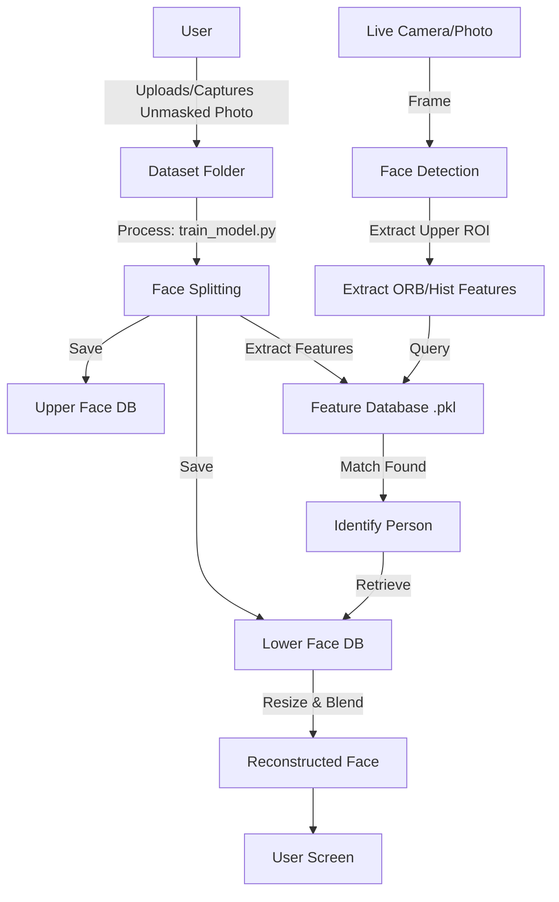

# Masked Face Reconstruction - Project Documentation

## 1. Methodology

### Problem Statement
The goal of this project is to "unmask" a person in a photo or video stream who is wearing a face mask. Since the information beneath the mask is physically lost in the moment of capture, we cannot "see" through the mask. Instead, we relay on a **Database-Assisted Reconstruction** approach.

### Core Concept
The system operates on the premise that we have previously seen the person without a mask. The methodology involves two distinct phases:

1.  **Enrollment (Training Phase)**: 
    - We capture a clear, unmasked photo of the user.
    - We conceptually "split" this photo into two parts:
        - **Upper Face (Eyes/Forehead)**: This is the "Key" or "Query" region, which remains visible even when wearing a mask.
        - **Lower Face (Nose/Mouth/Chin)**: This is the "Value" or "Target" region, which is obscured by the mask.
    - We extract mathematical features (ORB descriptors, Color Histograms) from the Upper Face and store them in a database, linked to the Lower Face image.

2.  **Inference (Reconstruction Phase)**:
    - When a masked face is detected in a live stream or photo, we isolate the visible Upper Face.
    - We extract the same features from this live Upper Face.
    - We query our database to find the best match (Recognizing the person based on their eyes/forehead).
    - Once the identity is confirmed, we retrieve the corresponding *Lower Face* from our storage.
    - We digitally stitch (using Image Processing techniques like resizing and seamless cloning) the stored Lower Face onto the live masked face, effectively "removing" the mask.

## 2. System Flow

### A. Data Flow Logic

### B. User Experience Flow
1.  **Dataset Collection**: User navigates to `/dataset_page`, enters their name, and captures a clean face photo.
2.  **Training**: User navigates to `/train_page` and clicks "Train Model". The system processes the dataset.
3.  **Live Demo**: User navigates to the Home page or `/video_feed`. They wear a mask. The system detects them, identifies them by their eyes, and overlays their nose/mouth.
4.  **Static Photo**: User can upload a masked photo at `/photo_page` to see the reconstruction result.

## 3. Detailed Code Explanation

### 1. `app.py` (The Web Server)
This is the entry point of the Flask application.
-   **Routes**: Handles navigation between pages (`/`, `/train_page`, etc.).
-   **API Endpoints**:
    -   `/video_feed`: Streams the processed video using a generator function `gen()`.
    -   `/train`: Triggers the training process via `train_model.py`.
    -   `/capture`: Saves a raw base64 image from the browser to the server.
    -   `/detect_photo`: Accepts a static image, processes it via `camera.process_static_image()`, and returns the result.

### 2. `train_model.py` (The Enrollment Engine)
Responsible for preparing the database.
-   **`split_face(image_path)`**: 
    -   Uses `face_recognition` library to detect facial landmarks.
    -   Finds the nose tip to determine the "split line" between upper and lower face.
    -   Returns two images: `upper_part` and `lower_part`.
-   **`extract_features(upper_img)`**:
    -   Converts the upper face to grayscale.
    -   Uses **ORB (Oriented FAST and Rotated BRIEF)** to detect keypoints and descriptors. ORB is fast and rotation invariant.
    -   Calculates a **Color Histogram** as a fallback metric (if image texture is too low for ORB).
-   **`train_dataset()`**: 
    -   Iterates through all images in `dataset_unmasked/`.
    -   Splits them and saves parts to `db_upper/` and `db_lower/`.
    -   Saves the extracted features map to `features_db.pkl`.

### 3. `camera.py` (The Vision Core)
Handles real-time processing and reconstruction logic.
-   **Face Detection**:
    -   Tries to use a **DNN (Deep Neural Network)** model (`res10_300x300...`) for robust face detection by default.
    -   Falls back to **Haar Cascades** if the DNN fails.
-   **Validation (`validate_face_region`)**:
    -   Filters out false positives by checking aspect ratio, skin color probability, and size.
    -   *Note*: The validation is "relaxed" to account for masks covering skin.
-   **Matching (`find_candidate`)**:
    -   Compares live features against the `features_db.pkl`.
    -   Uses **KNN (K-Nearest Neighbors)** matching with Lowe's Ratio Test to find good feature matches.
    -   Uses **RANSAC** to verify geometric consistency of matches.
-   **Reconstruction (`reconstruct_face_region`)**:
    -   Once a match is found, loads the corresponding Lower Face.
    -   **Alignment**: Resizes the stored lower face to match the width of the live detected face.
    -   **Blending**: Uses `cv2.seamlessClone` (Poisson Blending) to blend the pasted mouth onto the live face naturally, smoothing out color differences at the seams. If that fails, it falls back to a simple overlay.

## 4. Dependencies
-   **Flask**: Web server framework.
-   **OpenCV (`cv2`)**: Image processing, face detection, feature extraction.
-   **Face Recognition (`face_recognition`)**: Dlib-based landmark detection for accurate splitting.
-   **Numpy**: Matrix operations.
